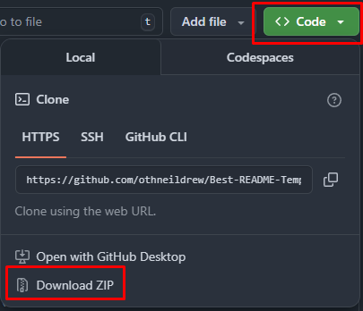
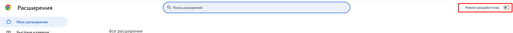
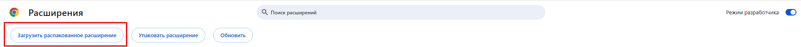
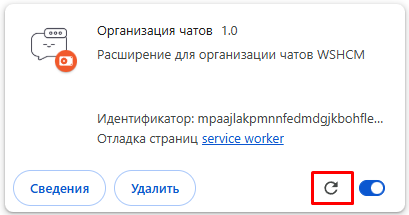
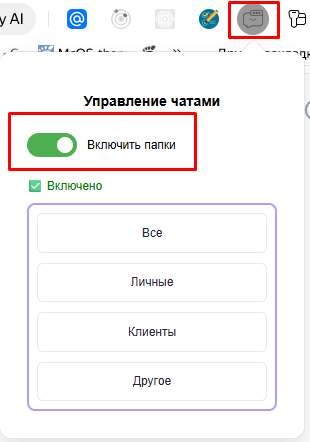
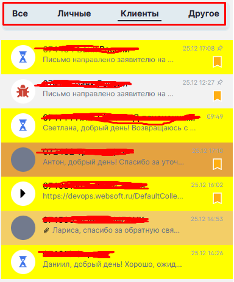
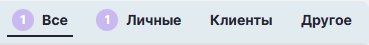
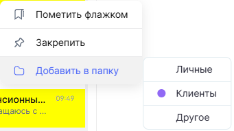
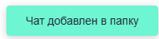

 

  <h3 align="center">Управление чатами</h3>

<!-- TABLE OF CONTENTS -->

  
Навигация

  <ol>
    <li>
      <a href="#about-the-project">Описание</a>
    </li>
    <li>
      <a href="#getting-started">Начало</a>
      <ul>
        <li><a href="#installation">Установка</a></li>
        <li><a href="#update">Обновление</a></li>
      </ul>
    </li>
    <li><a href="#usage">Использование</a></li>
    <li><a href="#feedback">Обратная связь</a></li>
  </ol>

<!-- ABOUT THE PROJECT -->

## О проекте

Расширение для управления чатами в workspace. Используется JS, HTML, CSS, chrome.storage API.
Работает только на сайтах my.websoft.ru и clients.websoft.ru.

(<a href="#readme-top">наверх</a>)

<!-- GETTING STARTED -->

## Начало

Раздел с инструкциями.

### Установка

<ol>
  <li>Скачать zip-архив с расширением. 
  
  </li>
  <li>Распаковать расширение в папку на ПК, где его удобно будет хранить.</li>
  <li>Перейти в управление расширениями в браузере или по ссылке browser://extensions/ (chrome://extensions/)</li>
  <li>Включить Режим разработчика. 
  
  </li>
  <li>Нажать кнопку "Загрузить распакованное расширение" и выбрать корневую папку с расширением (TalkBox_WSHCM-main). 
  
  </li>
  <li>Обновить страницу workspace в браузере.</li>
</ol>

(<a href="#readme-top">наверх</a>)

### Обновление

<ol>
  <li>Скачать zip-архив с расширением. 
  
  </li>
  <li>Распаковать расширение в папку на ПК, где находится установленное расширение с заменой всех файлов.</li>
  <li>Перейти в управление расширениями в браузере или по ссылке browser://extensions/ (chrome://extensions/)</li>
  <li>Обновить расширение в браузере. 
  
  </li>
  <li>Обновить страницу workspace в браузере.</li>
</ol>

<!-- USAGE EXAMPLES -->

## Использование

### Использование расширения и описание функционала

<ol>
  <li>Расширение можно включать и выключать. Данные по сортировке при этом сохраняются. 
  
  </li>
  <li>Возможность переименовывать папки. Для возможности режактирования просто кликнуть на нужную папку. 
  Изменение применяется нажатием на клавишу Enter или потерю фокуса. 
  
  </li>
  <li>Возможно переключаться между папками. 
  
  </li>
  <li>Счетчик непрочитанных чатов. 
  Счетчик отображается всегда в папке "Все" и в папке, куда добавлен чат. 
  Считается не по сообщениям в чате, а по непрочитанным чатам. Если больше 9 чатов, то в счетчике выводится "9+" 
  
  </li>
  <li>Добавление чата в папку происходит через контекстное меню. 
  После добавления чата в папку, появляется индикатор возле папки, в которую добавлен чат. 
  1 чат можно добавлять в несколько папок одновременно. 
  
  </li>
  <li>Удаление чата из папки происходит повторным нажатием на папку, куда добавлен чат, через контекстное меню. 
  Работает в любой папке. 
  Из папки "Все" чаты удалить нельзя.
  </li>
  <li>Показ уведомлений при удалении/добавлении чата. 
  
  </li>
  <li>Данные сохраняются между перезагрузками ПК/Браузера или очистке кэша, если намеренно не чистить кэш приложения.
  </li>
</ol>

### Ограничения

<ol>
  <li>Расширение работает только на фронте, поэтому данные сохраняются только в браузере, где установлено расширение. 
  Если вы решите сменить браузер и установить расширение, то сортировку придется делаться повторно 
  Аналогично работает с режимом инкогнито в браузере.
  </li>
  <li>Работает только на my.websoft.ru и clients.websoft.ru и только в браузере.
  </li>
  <li>Есть небольшая вынужденная задержка при изначальной инициализации расширения, чтобы все точно отрисовалось. Будет оптимизироваться.
  </li>
</ol>

### Ближайшие исправления/доработки

<ol>
  <li>Исправление позиционирования дополнительного меню. <b>(исправлено 26.12.25)</b>
  </li>
  <li>Добавление пользовательских папок.
  </li>
  <li>Запоминать папку, в которой находился пользователь перед обновлением страницы. <b>(сделано 26.12.25)</b>
  </li>
  <li>Исправить отображение папок при переходе на другие страницы <b>(исправлено 26.12.25)</b></li>
  <li>Синхронизация расширения с разными браузерами</li>
  <li>Фильтровать тикеты клиентов сразу в папку. Опционально.</li>
</ol>

## Обратная связь

Пожелания и исправления просьба писать в личку любым удобным способом.

## Благодарности

Спасибо Светлане Орловой и Алексею Осотову за помощь в тестировании на этапе разработки и идеи.

(<a href="#readme-top">наверх</a>)

